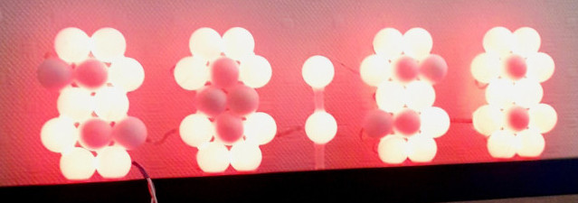

# Christux Ping Pong Clock

Spécial thanks to original ping pong clock !

Clock panel design :
 
       o o     o o         o o     o o
      o o o   o o o   o   o o o   o o o
       o o     o o         o o     o o
      o o o   o o o   o   o o o   o o o
       o o     o o         o o     o o

Needs to add a ledmap.json to simulate a 5x25 led wall for 2D effects :

{
"n": "clock_panel",
"width": 25,
"height": 5,
"map":[
-1,  7, -1,  8, -1, -1, -1, 19, -1, 20, -1, -1, -1, -1, -1, 28, -1, 29, -1, -1, -1, 48, -1, 49, -1,
 5, -1,  6, -1,  9, -1, 17, -1, 18, -1, 21, -1, 25, -1, 26, -1, 27, -1, 30, -1, 47, -1, 46, -1, 45,
-1,  4, -1, 10, -1, -1, -1, 16, -1, 22, -1, -1, -1, -1, -1, 32, -1, 31, -1, -1, -1, 44, -1, 43, -1,
 2, -1,  3, -1, 11, -1, 12, -1, 15, -1, 23, -1, 24, -1, 33, -1, 36, -1, 37, -1, 38, -1, 41, -1, 42,
-1,  1, -1,  0, -1, -1, -1, 13, -1, 14, -1, -1, -1, -1, -1, 34, -1, 35, -1, -1, -1, 39, -1, 40, -1
]
}

